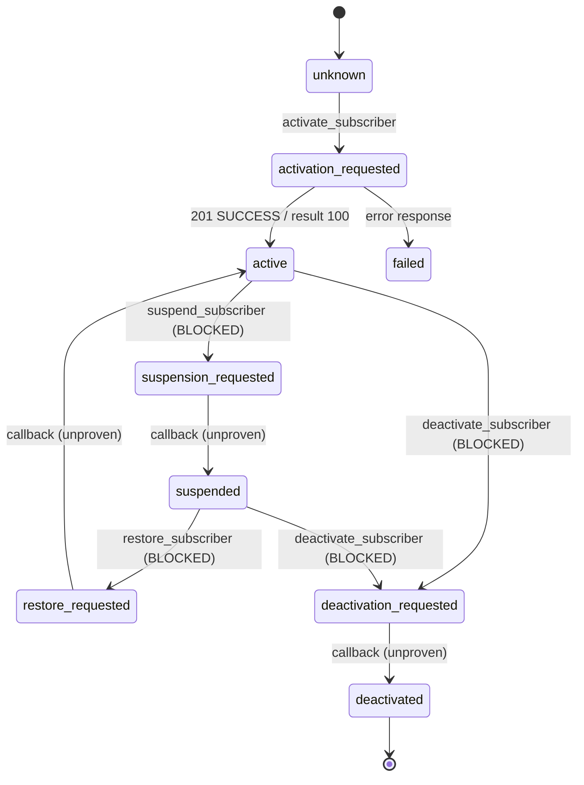

# T-Mobile Wholesale — API operation inventory

> **SUPERSEDED IN PART — 2026-07-21.** The "no vendor contract exists" premise
> below is no longer true: authorized vendor documentation has since been
> obtained and the implementation reconciled against it (evidence reference
> `TMO-REST-RECON-001`). The reconciliation found the previously derived paths
> wrong for **every** operation, four wrong HTTP methods, and a wrong request
> body on every lifecycle call — which is why the blocking decision recorded
> here was correct.
>
> **Current status lives in `TMOBILE_OPERATION_READINESS.md`.** The path/method
> table below is retained as the historical record of the derived values and
> must not be used as a contract reference. Detailed contract facts are not
> published here — this repository is public and the vendor material is
> confidential.

> **Authoritative source:** `api/app/integrations/tmobile_operations.py`. This
> page is the human-readable rendering; the module is what the harness enforces.
> `python ../scripts/tmobile_pit.py operations` prints the live state.

| Metadata | |
|---|---|
| **Authority Level** | 3 — Execution |
| **Created** | 2026-07-21 |
| **Status** | 1 operation sendable · 7 blocked |
| **Related** | `TMOBILE_PIT_CERTIFICATION_PLAN.md` · `TMOBILE_PIT_OPERATOR_RUNBOOK.md` · `TMOBILE_PIT_TEST_SIM_POLICY.md` |

---

## 1. The finding that shapes everything below

**This repository contains no T-Mobile OpenAPI specification, Postman
collection, PDF, or reference implementation.** The search covered every
tracked file; the only T-Mobile artifacts are our own code, our own docs, and
one sanitized evidence fixture.

Every subscriber-family path in `tmobile_taap.py` is produced by our own string
join:

```python
def _subscriber_path(self, op: str) -> str:
    return f"{self.subscriber_base_path}/{op.lstrip('/')}"
```

**That derivation is demonstrably wrong.** The only operation we can verify —
activation — works at `/wholesale/v1/subscriber/activation`, set explicitly via
`TMOBILE_ACTIVATION_PATH`. The derived default is `/wholesale/v1/subscriber/activate`.
Had we trusted the derivation, the activation that succeeded would have gone to
a path that does not exist.

If the derivation is wrong for the one endpoint we can check, `/suspend`,
`/restore`, `/deactivate`, `/inquiry`, and `/changesim` are guesses. Sending a
guess to a carrier gateway aimed at a real subscriber is not a cheap experiment.

**So: operations with derived paths are BLOCKED from sending.** They remain
implemented, documented, and mock-tested. Unblocking requires T-Mobile's written
answer recorded in the repository plus a reviewed provenance change — never a
config toggle.

---

## 2. Provenance levels

| Level | Meaning | Sendable |
|---|---|---|
| `confirmed_by_live_response` | We sent it; T-Mobile answered with a success | ✅ |
| `tmobile_written_spec` | T-Mobile supplied a written contract stored in this repo | ✅ |
| `derived_unconfirmed` | Path produced by our own derivation | ❌ **blocked** |

No operation currently holds `tmobile_written_spec` — no such artifact exists here.

## 3. Risk classes

| Class | Meaning | Gates required |
|---|---|---|
| **A** Read-only | Cannot change subscriber state | allowlist (read-only tier) |
| **B** Reversible | Changes state; documented inverse exists | `--confirm-live` + lifecycle tier |
| **C** Destructive | Terminal or not cleanly reversible | `--confirm-live` + `--confirm-destructive` + `--reason` + destructive tier |
| **D** Unknown | Semantics not established | **always blocked** |

---

## 4. The inventory

| Operation | Class | Method / path | Provenance | Sendable |
|---|---|---|---|---|
| `activate_subscriber` | B | `POST /wholesale/v1/subscriber/activation` | confirmed by live 201 | ✅ |
| `subscriber_inquiry` | A | `POST /wholesale/v1/subscriber/inquiry` | derived | ❌ |
| `query_network` | A | `POST /wholesale/network/v1/query` | hard-coded literal | ❌ |
| `query_usage` | A | `POST /wholesale/usage/v1/query` | hard-coded literal | ❌ |
| `suspend_subscriber` | B | `POST /wholesale/v1/subscriber/suspend` | derived | ❌ |
| `restore_subscriber` | B | `POST /wholesale/v1/subscriber/restore` | derived | ❌ |
| `change_sim` | C | `POST /wholesale/v1/subscriber/changesim` | derived | ❌ |
| `deactivate_subscriber` | C | `POST /wholesale/v1/subscriber/deactivate` | derived | ❌ |

Full per-operation detail — request/response schema, callback behavior, required
headers, PoP ehts, sync/async, reversibility, prerequisites, PIT restrictions,
implementation and test status — is in the module and via
`python ../scripts/tmobile_pit.py show <operation>`.

### 4.1 The one confirmed operation

**`activate_subscriber`** — `POST /wholesale/v1/subscriber/activation`

- **Request:** `{iccid, marketZip, language, baseProduct:{baseProductId, wps, product:[…]}}`, compact-serialized, hashed into the PoP `edts`.
- **Response (observed):** `{status, msisdn, iccid, accountId, result:[{result, status}]}`. Only result code `100` has ever been seen — **the full result-code vocabulary is undocumented.**
- **PoP ehts:** `Content-Type;Authorization;uri;http-method;body` (OAuth and resource alike).
- **Headers:** `Authorization`, `X-Authorization`, `Content-Type`, `Accept`, `X-Correlation-Id`, `partner-transaction-id`, `partner-id`, `sender-id`, `call-back-location` (mandatory).
- **Callback:** T-Mobile documented the account ID as returned asynchronously. On the 2026-07-21 success it arrived in the **synchronous 201 body**, and **no callback has been confirmed**.
- **Reversibility:** in principle by deactivation — but deactivation is blocked, so treat an activation as **effectively irreversible**.

### 4.2 Why each blocked operation is blocked

All seven share the same root cause: no T-Mobile-supplied contract. Beyond the
path, we also do not know any response schema (none has ever been observed),
whether the call is synchronous or asynchronous, or what state it leaves the
line in. `python ../scripts/tmobile_pit.py show <operation>` prints the exact
questions T-Mobile must answer — 8 standard, plus operation-specific ones such
as:

- `query_usage` — the required date format for `startDate` / `endDate`.
- `suspend_subscriber` — whether suspension has a maximum duration after which the line auto-deactivates.
- `restore_subscriber` — whether restore returns the **original** MSISDN.
- `change_sim` — whether a swapped-out ICCID can be re-attached.
- `deactivate_subscriber` — whether the MSISDN is released, and whether any grace period exists.

`change_sim` is classified **destructive** rather than reversible: the swap
detaches the original ICCID and no documented operation restores it.

---

## 5. Lifecycle state machine

Defined in `api/app/integrations/tmobile_lifecycle.py`. Solid arrows are
confirmed by evidence; dashed arrows depend on a **blocked** operation and are
modelled but unproven.



**Confirmed states:** `unknown`, `activation_requested`, `active`, `failed`.
**Modelled but unconfirmed:** `suspended`, `deactivated`, and all `*_requested`
states other than activation's.

Enforced rules:

- **Terminal.** `deactivated` accepts no operation.
- **Pending blocks duplicates.** A second state-changing request while a `*_requested` state is outstanding is refused as a probable duplicate — reconcile first.
- **Invalid transitions refused,** with the legal set listed in the error.
- **The state machine never out-claims the inventory** — a transition for a blocked operation is always `confirmed=False`, pinned by a test.

---

## 6. Status vocabulary

Use these words precisely; they are not interchangeable.

| Term | Means |
|---|---|
| **Implemented** | Code exists in `tmobile_taap.py` |
| **Documented by T-Mobile** | A written contract from T-Mobile is stored in this repository — **currently true of nothing** |
| **Tested in mocks** | Covered by the automated suite with `respx` |
| **Tested live in PIT** | Actually sent to T-Mobile and answered — **currently true of activation only** |
| **Awaiting T-Mobile clarification** | Blocked; questions listed in the module |
| **Production-ready** | Meets every gate in `TMOBILE_PRODUCTION_READINESS.md` — **currently true of nothing** |

| Operation | Implemented | Documented | Mock-tested | Live-tested | Production-ready |
|---|---|---|---|---|---|
| `activate_subscriber` | ✅ | ❌ | ✅ | ✅ | ❌ |
| all seven others | ✅ | ❌ | ✅ | ❌ | ❌ |
